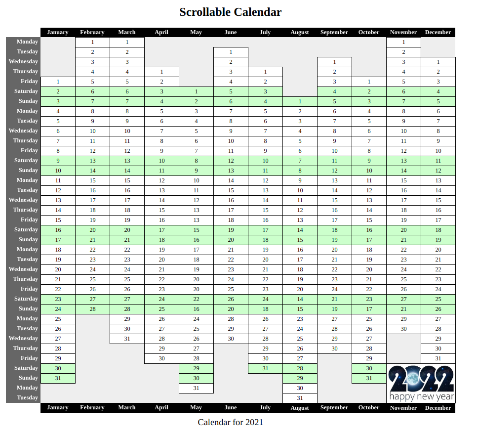
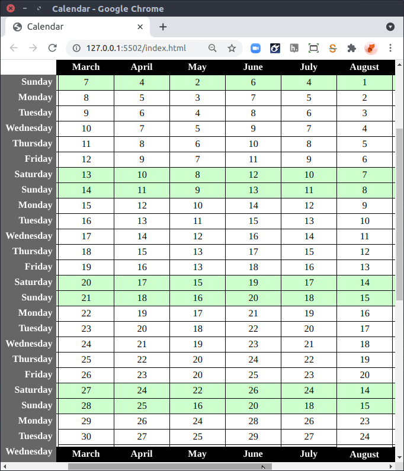

# Instructions

You'll find an index.html file in this folder which represents a calendar for the year 2021. You'll also find an empty file at `css/styles.css`.

## Edit styles.css
- Centre the heading
- Show the caption under the calendar
- Make the Month names in the `tbody` and `tfoot` always visible
- Make the Weekday column always visible
- Make the Month name rows black with white text
- Make the Weekdays column dark grey with white text
- Align the Weekdays column to the right
- Show all dates centred
- Show a border around each date cell
- Do not show borders in the header rows or column
- Make the cells at the top and bottom left white with no border
- Make all Month columns of equal width
- Show weekends in green

## Edit the HTML file and create an entry in styles.css:
- Merge the group of cells below the end of November and December, and show the New Year image in the cell.

The completed calendar:

The calendar when it is being scrolled:

